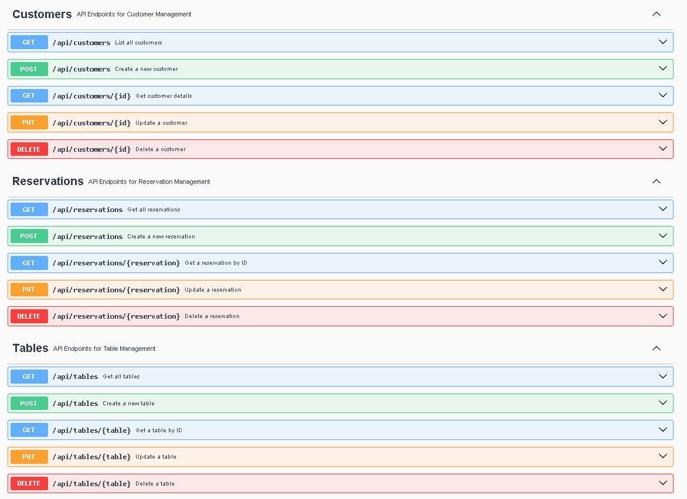

# 🍽️ Sistema de Gestión de Reservaciones para Restaurantes

[](https://www.php.net/)
[](https://laravel.com/)

## 📝 Descripción General

Este proyecto implementa un sistema robusto y eficiente para la gestión de reservaciones en restaurantes. Permite la administración de mesas, registro de comensales y gestión de reservaciones. La aplicación sigue una **arquitectura hexagonal** y emplea el patrón **CQRS** (Command Query Responsibility Segregation).

---

## ✨ Características Principales

- **Gestión de Mesas:** Capacidad, ubicación y estado (disponible/reservada).
- **Gestión de Comensales:** Registro, contacto e historial.
- **Gestión de Reservaciones:** Crear, modificar, cancelar, asignar mesas.
- **API Documentada:** Swagger/OpenAPI.
- **Arquitectura Robusta:** Hexagonal + CQRS + DDD.

---

## 🧰 Tecnologías Utilizadas

| Tecnología      | Logo                                                                                                       |
|-----------------|------------------------------------------------------------------------------------------------------------|
| Laravel 12.9.2  |                            |
| PHP ≥ 8.4       |                      |
| MySQL           |            |
| Docker          |  |
| OpenAPI/Swagger |                |

---

## 🏗️ Arquitectura

### 🔷 Hexagonal

- **Dominio:** Entidades, lógica, servicios, sin dependencias externas.
- **Aplicación:** Orquestación con comandos y consultas.
- **Infraestructura:** Implementación de repositorios y acceso a datos.
- **Interfaces:** Controladores REST, documentación y recursos.

### 🔁 CQRS

- **Write Model (Comandos):** Crear, actualizar, eliminar.
- **Read Model (Consultas):** Solo lectura, sin modificar estado.

---

# ✅ Beneficios del Patrón CQRS y Arquitectura Hexagonal
* Separación de Responsabilidades: Clara distinción entre operaciones de lectura y escritura.
* Escalabilidad: Optimización independiente para operaciones de lectura y escritura.
* Testabilidad: Facilita la creación de pruebas unitarias y de integración.
* Mantenibilidad: Código más organizado y desacoplado.
* Evolución: Facilita cambios en la infraestructura sin afectar la lógica de negocio.


## 🧩 Entidades 

### 🍽️ Mesas (Tables)

- `id`, `numero`, `capacidad`, `ubicacion`, timestamps

### 👤 Comensales (Customers)

- `id`, `nombre`, `correo_electronico`, `telefono`, `direccion`, timestamps

### 📅 Reservaciones (Reservations)

- `id`, `comensal_id`, `mesa_id`, `fecha_hora`, `numero_personas`, `notas`, `estado`, timestamps

---

## 📁 Estructura del Proyecto

```plaintext
ReservationManagement/
├── Tables/
├── Customers/
└── Reservations/
    ├── application/
    │   └── internal/
    │       ├── commandservices/
    │       └── queryservices/
    ├── domain/
    │   ├── exceptions/
    │   ├── model/
    │   │   ├── aggregates/
    │   │   ├── commands/
    │   │   └── queries/
    │   └── services/
    ├── infrastructure/
    │   └── persistence/
    └── interfaces/
        └── rest/
            ├── documentation/
            └── resources/
```
## 📖 Documentación de la API
   La API está documentada usando OpenAPI/Swagger y se puede acceder a través de:

```
/api/documentation – Interfaz interactiva de Swagger UI
```
# 🧪 Pruebas Unitarias
``` bash
php artisan test
```

Este proyecto incluye una **suite completa de pruebas unitarias** diseñada para garantizar la **calidad**, **estabilidad** y **correctitud** de cada capa de la aplicación.  
Las pruebas están organizadas conforme a la **Arquitectura Hexagonal** y siguen los principios de **Domain-Driven Design (DDD)**.

---

## 📦 Categorías de Pruebas

### ✅ Pruebas de Dominio
- Verifican las **reglas de negocio**, validaciones y comportamiento de agregados y objetos de valor.
- Ejemplo: Asegurar que no se pueda crear una reservación sin una mesa o cliente válido.

### 🧩 Pruebas de Repositorio
- Validan la correcta **persistencia** y **recuperación** de entidades del dominio mediante interfaces de repositorio.
- Se centran en la interacción con la base de datos usando Eloquent u otros drivers personalizados.

### ⚙️ Pruebas de Servicios de Aplicación
- Evalúan los **comandos** (operaciones de escritura) y **consultas** (operaciones de lectura).
- Verifican la lógica de orquestación y el uso correcto de servicios del dominio.

### 🌐 Pruebas de API (Feature Tests)
- Simulan peticiones HTTP y prueban los endpoints REST.
- Evalúan todo el ciclo de vida de una petición: rutas, validación, controladores y respuestas.

#### 🧪 API de Clientes
- ✅ Obtener todos los clientes
- ✅ Obtener cliente por ID
- ✅ Crear cliente con datos válidos
- ✅ Actualizar cliente existente
- ✅ Eliminar cliente existente
- 🔴 Manejo de ID inexistente (404)
- 🔴 Validación de datos en creación/actualización

#### 🧪 API de Reservaciones
- ✅ Obtener todas las reservaciones
- ✅ Obtener reservación por ID
- ✅ Crear reservación con datos válidos
- ✅ Actualizar reservación existente
- ✅ Eliminar reservación
- 🔴 Manejo de ID inválidos (404)
- 🔴 Validación de campos requeridos y llaves foráneas

#### 🧪 API de Mesas
- ✅ Listar todas las mesas
- ✅ Ver una mesa específica
- ✅ Registrar mesa con datos válidos
- ✅ Actualizar y eliminar mesa
- 🔴 Manejo de mesa inexistente (404)
- 🔴 Validación de datos incompletos

### 🚨 Pruebas de Manejo de Excepciones
- Aseguran que el sistema maneja correctamente:
    - Excepciones de dominio (reservas, clientes, mesas)
    - Errores de validación
    - Recursos no encontrados
    - Errores inesperados del sistema

---

## 🐳 Dockerización del Proyecto

Este sistema ha sido **dockerizado completamente**, separando los entornos del backend (Laravel + PHP) y la base de datos (MySQL) en **contenedores independientes**, facilitando el despliegue, la escalabilidad y el mantenimiento del proyecto.

---

### 📦 Estructura de Contenedores

| Servicio   | Imagen Base           | Puerto Expuesto | Función                                   |
|------------|-----------------------|------------------|--------------------------------------------|
| php-app    | php:8.4-fpm-alpine    | 8000             | Contenedor principal que ejecuta Laravel  |
| mysql-db   | mysql:8.0             | 3307             | Contenedor de base de datos MySQL         |

---

### ⚙️ Archivo `docker-compose.yml`

```yaml
version: '3.8'

services:
    app:
        build:
            context: .
            dockerfile: Dockerfile
        container_name: php-app
        volumes:
            - ./:/var/www
        working_dir: /var/www
        ports:
            - "8000:8000"
        networks:
            - app-network
        depends_on:
            - db
        environment:
            DB_CONNECTION: mysql
            DB_HOST: db
            DB_PORT: 3306
            DB_DATABASE: restaurant_db
            DB_USERNAME: root
            DB_PASSWORD: root

    db:
        image: mysql:8.0
        container_name: mysql-db
        restart: unless-stopped
        environment:
            MYSQL_DATABASE: restaurant_db
            MYSQL_ROOT_PASSWORD: root
        volumes:
            - dbdata:/var/lib/mysql
        ports:
            - "3307:3306"
        networks:
            - app-network

networks:
    app-network:
        driver: bridge

volumes:
    dbdata:

```


## ⚙️ Instalación y Configuración

Puedes ejecutar este proyecto de dos formas: instalación local tradicional o usando Docker.

---

## 🖥️ Instalación Local (Sin Docker)

### 1. Clonar el repositorio
```bash
git clone https://github.com/rivacortez/Backend-Desarrollo-de-Sistema-CRUD.git
```
```bash
cd Backend-Desarrollo-de-Sistema-CRUD
```
### 2. Instalar dependencias

```bash    
composer install
```
### 3. Configurar variables de entorno
Edita el archivo .env y ajusta los valores de la base de datos:
```bash  
DB_CONNECTION=mysql
DB_HOST=127.0.0.1
DB_PORT=3306
DB_DATABASE=restaurant_db
DB_USERNAME=root //cambia tu usuario local
DB_PASSWORD=root //cambia tu password local
```

### 4. Crear base de datos
Asegúrate de tener un servidor MySQL corriendo localmente y crea la base de datos:
```bash
CREATE DATABASE restaurant_db;
```
### 5. Generar clave de aplicación
```bash
php artisan key:generate
```
### 6. Migrar base de datos
```bash
php artisan migrate
```
### 7. Cargar datos de prueba (opcional)
```bash
php artisan db:seed
```
### 8. Iniciar servidor
```bash
php artisan serve
```

### 9. Acceder a la API documentada con swagger
```bash
http://127.0.0.1:8000/api/documentation
```


# 🐳 Instalación con Docker
### 1. Clonar el repositorio
```bash
git clone https://github.com/rivacortez/Backend-Desarrollo-de-Sistema-CRUD.git
```
```bash
cd Backend-Desarrollo-de-Sistema-CRUD
```
### 2. Configura la conexión a MySQL en .env para que se conecte al contenedor db:

```bash
DB_CONNECTION=mysql
DB_HOST=db
DB_PORT=3306
DB_DATABASE=restaurant_db
DB_USERNAME=root //cambia tu username local
DB_PASSWORD=root //cambia tu password local
```

### 3. Construir y levantar los contenedores
```bash
docker-compose up -d --build
```
```bash
docker-compose run --rm app composer install
```
```bash
docker-compose run --rm app composer install
```
Esto levantará los contenedores:

* php-app (Laravel)

* mysql-db (Base de datos)

###
```bash
docker-compose run --rm app composer install
```

### 4. Acceder al contenedor de Laravel y  Ejecutar migraciones desde el contenedor
```bash
docker-compose exec app php artisan migrate
```

### url de la API documentada con swagger
```bash
http://127.0.0.1:8000/api/documentation
```
## 🌐 API

La aplicación expone una API RESTful documentada con Swagger (OpenAPI), permitiendo probar los endpoints de manera interactiva y facilitar la integración con otros sistemas.

### 📸 Evidencia de la API


